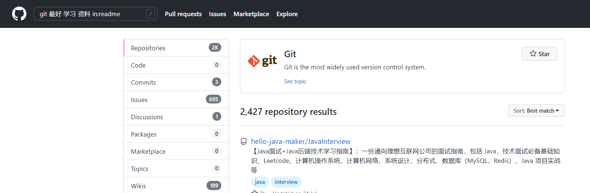
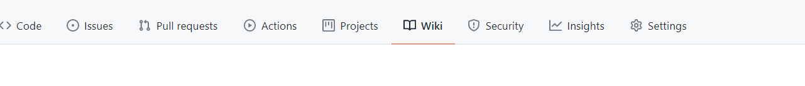

# 搜索项目

**github**支持高级搜索
**在readme中搜索**

```
git 最好 学习 资料 in:readme
```



这样子就会在readme文件中搜索 `git 最好 学习 资料`相关的项目

**搜索star大于某个值的项目**

```
git 最好 学习 资料 in:readme stars:>1000
```

# 如何向优秀项目提交自己的代码

> 通过pull request进行操作

+ fork代码到自己的仓库中

TODO

# release 增加包文件

TODO


## 项目增加详细的指导文档

使用的是`wike`功能



简单的使用，可以使用别人已经创建好的wike文件，将其传递到我们自己项目中，那么我们就可以修改了。

