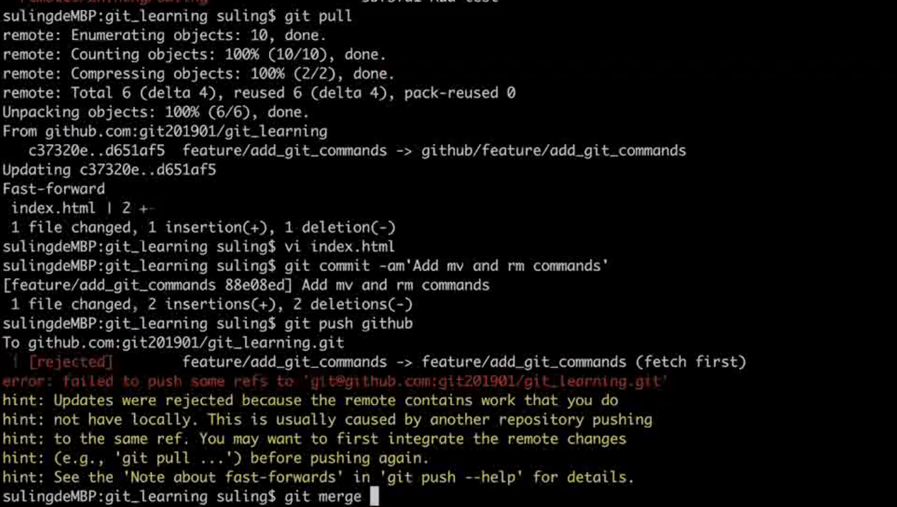
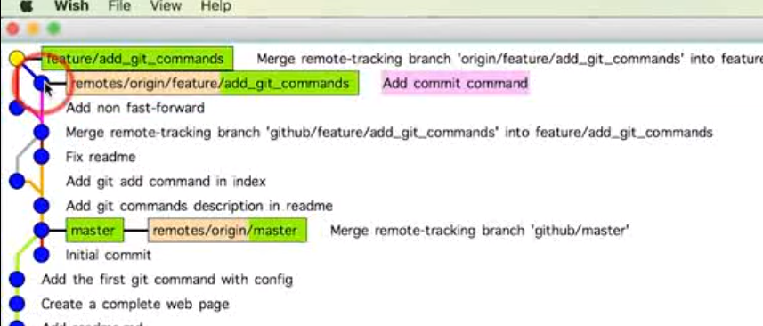
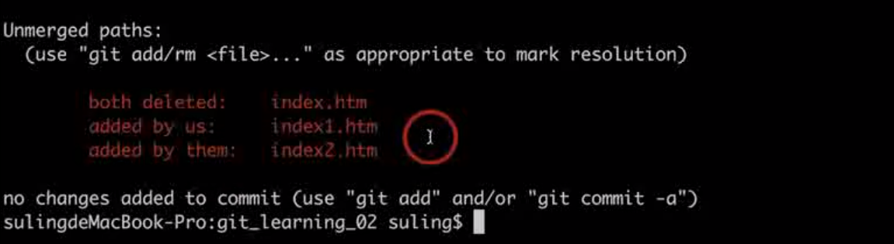
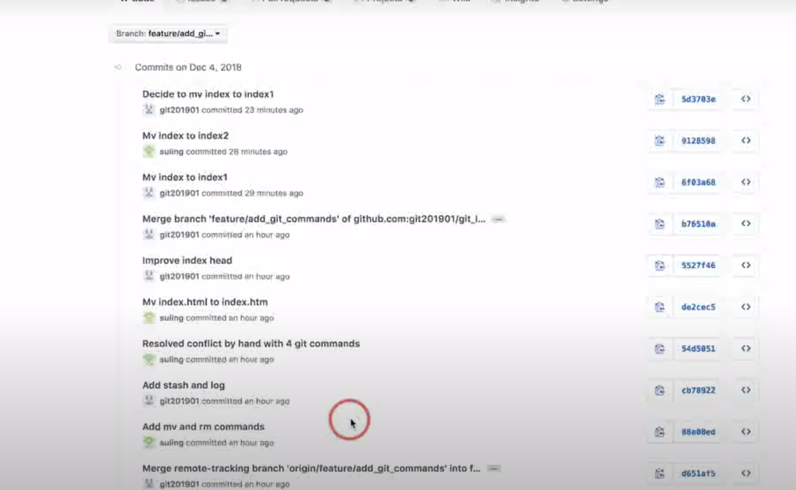
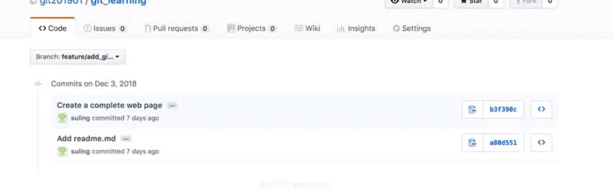

# 同步本地仓库到GitHub

**增加远程连接**

```
git remote add  remote_name http://git-server.com/path/to/repo.git
```

**push本地所有分支**

```
git push github --all
```

**同步远端代码**

远端存在文件，本地不存在。则需要先将远端的代码拉取得下来

```
git fetch github branch_name
```

进行合并

```
git merge github/master
```

对历史记录中不想关的两棵树进行合并

```
git merge --allow-unrelated-historuies  github/master
```

**样例**：

```
git remote add github https://github.com/jsabook/github_demo.git
```


```
git push github --all
```

看到分支都被push上来了。


**同步远端代码**——通过合并


可以看到左图的第一行到右边的第二行已经发生了合并操作。合并的特定就是，这棵树有2个父母节点。


# github冲突控制

```
fast-fowrards 如何理解
```



## 同人修改了不同文件如何处理？

+ 将文件从远端下载下来；

+ 将本地与远端进行合并；

  ```
  git merge github/feature/add_git_commands
  ```
+ 将本地变更的提交到云端

## 不同人修改了同文件的不同区域如何处理？

+ 将远端的fetch到本地；
+ 进行合并；



## 不同人修改了同文件的同一区域如何处理？

+ 本地合并远端；

  + 发现合并失败，因此需要一个个的修改冲突的地方
  
+ 修改之后有两种做法
  + 第一种做法，修改冲突之后的地方保留`merge`，进行`git commit -a "xxx"` 操作;
  + 第二种做法，回复到冲突之前；`git merge --abort`;

## 同时变更了文件名和文件内容如何处理？

+ 从云端自动pull到本地；
+ 本地会与云端合并，以云端为主；

**样例**

远端

```
index.html_remote
```

本地

```
inde.html
```

直接push肯定失败，因此需要先将远端pull到本地进行合并，合并完毕之后。`pull`操作。合并之后，文件变化

```
inde.html =>index.html_remote
```

## 同一文件改成了不同的文件名如何处理？

会将远端的文件也同时下下来。

用户1 操作

```
git mv index.htm  index1.htm
git push
```

用户2操作

```
git pull
```

用户2查看status状态



因此可以看到结果。即git如何处理这个同一个文件名改成2个完全不同的文件

+ 将远端代码拉取到本地；
+ 进行合并
  + 合并的操作——保持本地文件不变，将远端不同名字的也加到本地

# github 禁止操作


## 禁止强制覆盖远端

```
git push --force
```


是将本地历史覆盖到远端仓库的行为。

强制覆盖之前



强制覆盖之后



## 禁止修改远端集成分支的历史

分支历史变更，这个操作也是禁止的。

```
git rebase -i 
```

原因是因为，会修改远端的头指针的位置，从而导致后续提交的代码并不是位于`fast-forward`状态

