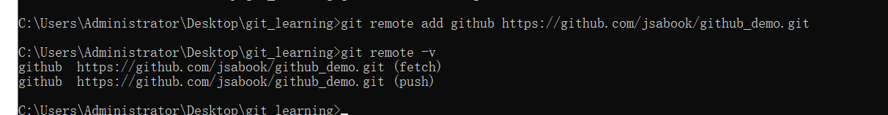
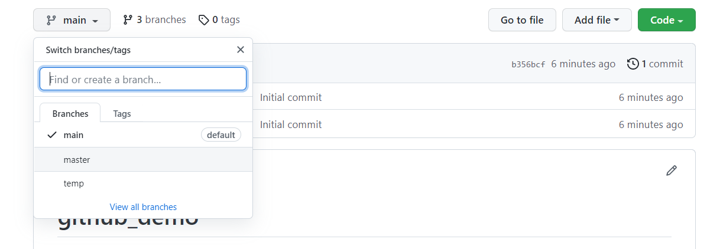
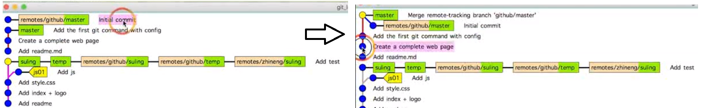

# 同步本地仓库到GitHub

**增加远程连接**

```
git remote add  remote_name http://git-server.com/path/to/repo.git
```

**push本地所有分支**

```
git push github --all
```

**同步远端代码**

远端存在文件，本地不存在。则需要先将远端的代码拉取得下来

```
git fetch github branch_name
```

进行合并

```
git merge github/master
```

对历史记录中不想关的两棵树进行合并

```
git merge --allow-unrelated-historuies  github/master
```

**样例**：

```
git remote add github https://github.com/jsabook/github_demo.git
```



```
git push github --all
```

看到分支都被push上来了。



**同步远端代码**——通过合并



可以看到左图的第一行到右边的第二行已经发生了合并操作。合并的特定就是，这棵树有2个父母节点。


# github冲突控制

## 同人修改了不同文件如何处理？


## 不同人修改了同文件的不同区域如何处理？


## 不同人修改了同文件的同一区域如何处理？


## 同时变更了文件名和文件内容如何处理？


## 同一文件改成了不同的文件名如何处理？


# github 禁止操作

