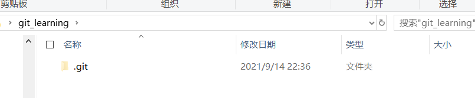
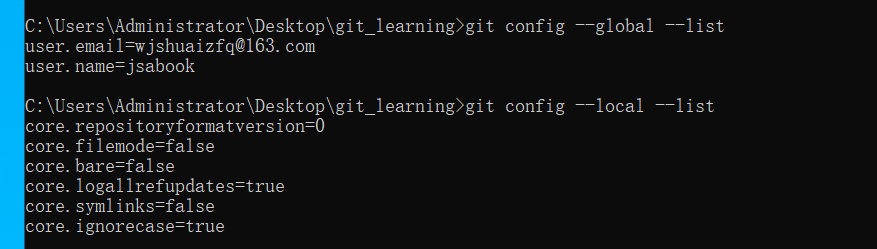
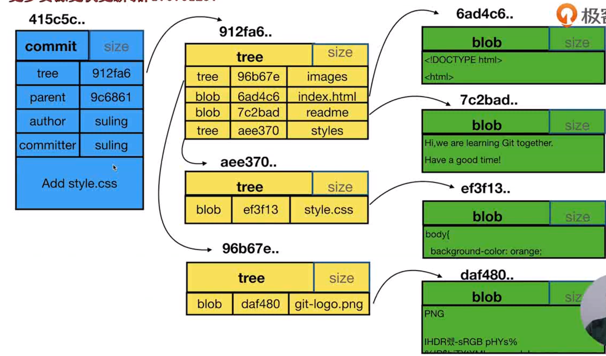
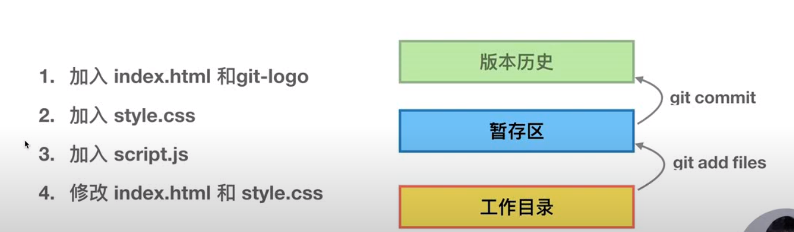
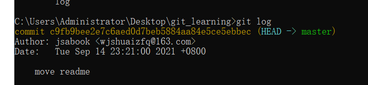
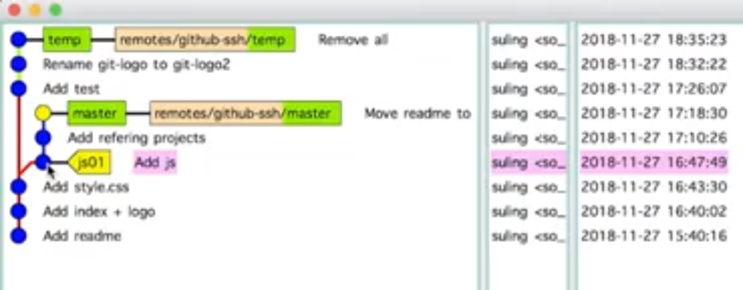
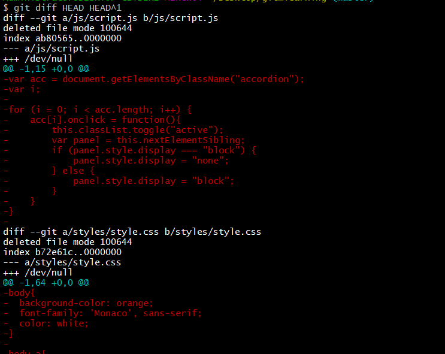
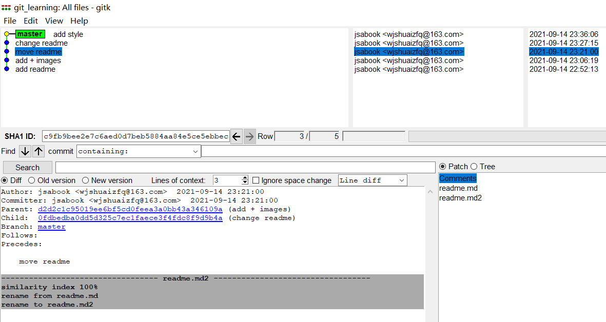

# git特点

+ 最优的存储能力
+ 非凡的性能
+ 开源
+ 很容易做备份
  + 分支管理成本很低
+ 支持离线操作


# git使用前准备


## git 安装

**windows 安装**

**Linux安装**

**Centos安装**


安装完毕之后，打开终端输入git --version

```
C:\Users\Administrator>git --version
git version 2.33.0.windows.2
```


## 配置user信息

需要配置`user.name`和`user.email`

```
git config --global user.name 'jsabook'
git config --global user.email 'wjshuaizfq@163.com'
```

config 的三个作用区：

```
git config --local 只对某个仓库有效
git config --global 对当前用户所有仓库有效
git config --system system 对系统所有登录的用户有效，基本不用
```

**登录的用户**这个指的是Linux的所有登录用户，还是指的是某个登录用户下的所有git用户。

显示config的配置

```
git config --list  --local 
git config --list --global
git config --list --system 
```

三者优先级：

```
local>global>system
```


# 创建仓库

创建本地git仓库

```
cd git_learning
git init
```

可以看到已经创建了一个最基本.`git`文件夹，也就是初始化完成。



查看仓库相关配置信息



可以看到local与global内容是不一样的。

将项目内容提交到本地git仓库中。

```
git add .
git commit -m " add readme"
```

查看日志

```
commit b9e79dbec097f6a95c3f09e7d0556fdbbaf05480 (HEAD -> master)
Author: jsabook <wjshuaizfq@163.com>
Date:   Tue Sep 14 22:52:13 2021 +0800

    add readme
```

commit id号

```
commit b9e79dbec097f6a95c3f09e7d0556fdbbaf05480 (HEAD -> master)
```

commit提交者

```
Author: jsabook <wjshuaizfq@163.com>
```

提交日期

```
Date:   Tue Sep 14 22:52:13 2021 +0800
```

# git目录

```
-rw-r--r-- 1 Administrator 197121  10 Sep 14 23:36 COMMIT_EDITMSG
-rw-r--r-- 1 Administrator 197121  23 Sep 14 23:51 HEAD
-rw-r--r-- 1 Administrator 197121  41 Sep 14 23:16 ORIG_HEAD
-rw-r--r-- 1 Administrator 197121 147 Sep 14 23:03 config
-rw-r--r-- 1 Administrator 197121  73 Sep 14 22:36 description
-rw-r--r-- 1 Administrator 197121 464 Sep 14 23:36 gitk.cache
drwxr-xr-x 1 Administrator 197121   0 Sep 14 22:36 hooks/
-rw-r--r-- 1 Administrator 197121 554 Sep 14 23:51 index
drwxr-xr-x 1 Administrator 197121   0 Sep 14 22:36 info/
drwxr-xr-x 1 Administrator 197121   0 Sep 14 22:52 logs/
drwxr-xr-x 1 Administrator 197121   0 Sep 14 23:36 objects/
drwxr-xr-x 1 Administrator 197121   0 Sep 14 22:36 refs/
```

**HEAD**

这个是一个引用，代表目前正在工作在哪个分支上面。

```bash
$ cat .git/HEAD
ref: refs/heads/master
$ git checkout temp
Switched to branch 'temp'
$ cat .git/HEAD
ref: refs/heads/temp
```

**refs**

存放着分支与tag的commit指针。

```
$ ls  .git/refs/
heads/  tags/
```

即对应的指针，只想着哪一个commit

```bash
$ cat .git/refs/heads/master
2f5490f46d7fff5ea7d80499985ceda8751c2039
$ git branch -av
  master 2f5490f add style
* temp   0116c65 add js
```

**objects**

会将所有的对象类型都存储到这个文件夹中。

```
$ find .git/objects/ -type f
.git/objects/01/16c65dbd1cab205c97f349311ca162850c904b
.git/objects/0f/dbedba0dd5d325c7ec1faece3f4fdc8f9d9b4a
.git/objects/2f/5490f46d7fff5ea7d80499985ceda8751c2039
.git/objects/3f/43ec286fdaec1ded34fa9ed0dfbe9cd485d81e
.git/objects/73/73d051ca7591e8a6efc48627e2670d0013c0b2
.git/objects/7c/2bad210b150a75f2734035454e60cde30b5c33
.git/objects/87/b3e92f70e7dfa555f141afeae28a2bc4a343b6
.git/objects/96/b67e399c8496ec36cbbbcb776eb924fad7f9a7
.git/objects/ab/80565b73e7d2f0a2b5b9667c0b3470238b0fc0
.git/objects/ae/731b9c462fa1baffd7e2d1f36b7115912c0313
.git/objects/b3/a9734778e03818a14f410a8719457ca3075965
.git/objects/b7/2e61c8b6782cd0fab5241ea2b044d1fe05be3f
.git/objects/b9/e79dbec097f6a95c3f09e7d0556fdbbaf05480
.git/objects/c0/f1e6fdf01b6ef8acd0a634e326ab29bf4be7df
.git/objects/c9/fb9bee2e7c6aed0d7beb5884aa84e5ce5ebbec
.git/objects/cc/9f0ed38273e792440071d17a11df4ba1b48ac1
.git/objects/d2/d2c1c95019ee6bf5cd0feea3a0bb43a346109a
.git/objects/da/f480669aa9256fa18b5c28e467af816f16482d
.git/objects/e8/7d0f44918e22fa948418c58a45fa8f078dc7a0
```

每一个文件都对应着一个git对象（可能是commit对象、可能是tree对象也有可能是blob对象）

查看每个文件对应的git对象类型

```bash
$ find .git/objects/ -type f
.git/objects/01/16c65dbd1cab205c97f349311ca162850c904b
.git/objects/0f/dbedba0dd5d325c7ec1faece3f4fdc8f9d9b4a
.git/objects/2f/5490f46d7fff5ea7d80499985ceda8751c2039
.git/objects/3f/43ec286fdaec1ded34fa9ed0dfbe9cd485d81e
.git/objects/73/73d051ca7591e8a6efc48627e2670d0013c0b2
.git/objects/7c/2bad210b150a75f2734035454e60cde30b5c33
.git/objects/87/b3e92f70e7dfa555f141afeae28a2bc4a343b6
.git/objects/96/b67e399c8496ec36cbbbcb776eb924fad7f9a7
.git/objects/ab/80565b73e7d2f0a2b5b9667c0b3470238b0fc0
.git/objects/ae/731b9c462fa1baffd7e2d1f36b7115912c0313
.git/objects/b3/a9734778e03818a14f410a8719457ca3075965
.git/objects/b7/2e61c8b6782cd0fab5241ea2b044d1fe05be3f
.git/objects/b9/e79dbec097f6a95c3f09e7d0556fdbbaf05480
.git/objects/c0/f1e6fdf01b6ef8acd0a634e326ab29bf4be7df
.git/objects/c9/fb9bee2e7c6aed0d7beb5884aa84e5ce5ebbec
.git/objects/cc/9f0ed38273e792440071d17a11df4ba1b48ac1
.git/objects/d2/d2c1c95019ee6bf5cd0feea3a0bb43a346109a
.git/objects/da/f480669aa9256fa18b5c28e467af816f16482d
.git/objects/e8/7d0f44918e22fa948418c58a45fa8f078dc7a0

Administrator@DESKTOP-GBTDERI MINGW64 ~/Desktop/git_learning (master)
$ for i in $(find .git/objects/ -type f | awk -F '/' '{ print $3$4 }'); do echo $i $(git cat-file -t $i) ;done
0116c65dbd1cab205c97f349311ca162850c904b commit
0fdbedba0dd5d325c7ec1faece3f4fdc8f9d9b4a commit
2f5490f46d7fff5ea7d80499985ceda8751c2039 commit
3f43ec286fdaec1ded34fa9ed0dfbe9cd485d81e tree
7373d051ca7591e8a6efc48627e2670d0013c0b2 tree
7c2bad210b150a75f2734035454e60cde30b5c33 blob
87b3e92f70e7dfa555f141afeae28a2bc4a343b6 tree
96b67e399c8496ec36cbbbcb776eb924fad7f9a7 tree
ab80565b73e7d2f0a2b5b9667c0b3470238b0fc0 blob
ae731b9c462fa1baffd7e2d1f36b7115912c0313 tree
b3a9734778e03818a14f410a8719457ca3075965 tree
b72e61c8b6782cd0fab5241ea2b044d1fe05be3f blob
b9e79dbec097f6a95c3f09e7d0556fdbbaf05480 commit
c0f1e6fdf01b6ef8acd0a634e326ab29bf4be7df tree
c9fb9bee2e7c6aed0d7beb5884aa84e5ce5ebbec commit
cc9f0ed38273e792440071d17a11df4ba1b48ac1 blob
d2d2c1c95019ee6bf5cd0feea3a0bb43a346109a commit
daf480669aa9256fa18b5c28e467af816f16482d blob
e87d0f44918e22fa948418c58a45fa8f078dc7a0 tree
```


**config**

```
$ cat .git/config
[core]
        repositoryformatversion = 0
        filemode = false
        bare = false
        logallrefupdates = true
        symlinks = false
        ignorecase = true
        autocrlf = true
[user]
        name = localjsabook

```

可以看到就是`git config --local`的内容。


# git 对象类型

在git目录中接触到了git的三个对象类型，分别是：`commit`、`tree`、`blob`。这三者之间的区别是：



**commit**

一个commit对应一颗树 ，这颗树是整个项目的快照，存放着就是当前commit本项目的所有文件夹以及文件的快照。即某一个时刻的项目快照通过这个tree来呈现出来。

**tree**

代表一个文件夹快照。一个tree是由多个**blob**组成的

**blob**

代表了一个文件

下面是一个样例。

```bash
$ git cat-file -p 2f5490f46d7fff5
tree c0f1e6fdf01b6ef8acd0a634e326ab29bf4be7df
parent 0fdbedba0dd5d325c7ec1faece3f4fdc8f9d9b4a
author jsabook <wjshuaizfq@163.com> 1631633766 +0800
committer jsabook <wjshuaizfq@163.com> 1631633766 +0800

add style

$ git cat-file -p c0f1e6fdf01b6
040000 tree 96b67e399c8496ec36cbbbcb776eb924fad7f9a7    images
100644 blob cc9f0ed38273e792440071d17a11df4ba1b48ac1    index.html
040000 tree 87b3e92f70e7dfa555f141afeae28a2bc4a343b6    js
100644 blob 7c2bad210b150a75f2734035454e60cde30b5c33    readme.md
040000 tree e87d0f44918e22fa948418c58a45fa8f078dc7a0    styles

$ git cat-file p  96b67e399c8
fatal: invalid object type "p"

$ git cat-file -p  96b67e399c8
100644 blob daf480669aa9256fa18b5c28e467af816f16482d    git-logo.png
 
$ git cat-file -p  7c2bad210b150a75
Hi,we are learning Git together.
Have a good time!

```


# commit与add的区别

这两者的区别，其实也就是git仓库中可用区与缓存区。

暂存区的作用：

+ 反向覆盖
  + 可以提交一次到暂存区，修改完毕之后，发现还没有暂存区中的代码完善那么就可以返回。
  + 暂存区的优势是没有记录到版本历史中，但同时也可以进行回退。即向前可以提交版本，退后可以内容覆盖。




向`git_learning`文件夹中添加一个index.html文件与一个image文件夹

```
2021/09/14  23:00    <DIR>          images
2018/12/03  19:39             1,439 index.html
2018/12/03  19:39                51 readme.md
```

将这新加入的文件添加到暂存区.

```
git add .
```

**PS**:对已经存在于git仓库中的文件，只要使用`git add -u` 就可以将所有已经存在于git仓库中的变更文件再次提交到git仓库中，而新创建的不存在于仓库中的文件，则不会加入。


查看`add`与`commit`前后的区别可以发现这个。

```
# add前
C:\Users\Administrator\Desktop\git_learning>git status
On branch master
Untracked files:
  (use "git add <file>..." to include in what will be committed)
        images/
        index.html
# add后
C:\Users\Administrator\Desktop\git_learning>git status
On branch master
Changes to be committed:
  (use "git restore --staged <file>..." to unstage)
        new file:   images/git-logo.png
        new file:   index.html
# commit后
C:\Users\Administrator\Desktop\git_learning>git status
On branch master
nothing to commit, working tree clean
```

文件的状态变化

```
add 前        add后        commit 后
Untracked -->new file---> nothing to commit
```

# 重命名文件名称

```
git mv source dest
```

例如:

```
git mv readme.md readme
git commit -m 'move readme.md to readme'
```

查看git日志，可以看到rename的操作已经被记录了。



# 分离头指针

```
git checkout cc9f0ed38273e79
echo 12345>index.html
```

切换到其他分支

```
git checkout master
```

那么之前所做的

```
echo 12345>index.html
```

就直接被删掉了。



并没有保留下来

# HEAD与branch

HEAD不仅仅可以指向某个branch分支的最新一次commit的指针。也可以指向某一个commit（分离头指针就是这种情况）的指针。

比较两个commit的区别

```
git diff HEAD HEAD^1
```




# 查看历史版本

**oneline**

```
git log --oneline
git log -n4 --oneline
```

**all**—查看所有分支历史版本

```
git log --all 
```

**graph**——图形化

```
git log --graph --all
```

```bash
C:\Users\Administrator\Desktop\git_learning>git log --graph --all
* commit 0fdbedba0dd5d325c7ec1faece3f4fdc8f9d9b4a (master)
| Author: jsabook <wjshuaizfq@163.com>
| Date:   Tue Sep 14 23:27:15 2021 +0800
|
|     change readme
|
* commit c9fb9bee2e7c6aed0d7beb5884aa84e5ce5ebbec
| Author: jsabook <wjshuaizfq@163.com>
| Date:   Tue Sep 14 23:21:00 2021 +0800
|
|     move readme
|
* commit d2d2c1c95019ee6bf5cd0feea3a0bb43a346109a
| Author: jsabook <wjshuaizfq@163.com>
| Date:   Tue Sep 14 23:06:19 2021 +0800
|
|     add + images
|
* commit b9e79dbec097f6a95c3f09e7d0556fdbbaf05480 (HEAD -> temp)
  Author: jsabook <wjshuaizfq@163.com>
  Date:   Tue Sep 14 22:52:13 2021 +0800

      add readme
```


提交者与作者的区别：

github尊重版权，因此存在一个作者，即这个commit上一个提交这是谁。

```
* commit 0fdbedba0dd5d325c7ec1faece3f4fdc8f9d9b4a (master)
| Author: jsabook <wjshuaizfq@163.com>
| Date:   Tue Sep 14 23:27:15 2021 +0800
|
|     change readme
|
* commit c9fb9bee2e7c6aed0d7beb5884aa84e5ce5ebbec
| Author: jsabook <wjshuaizfq@163.com>
| Date:   Tue Sep 14 23:21:00 2021 +0800
|
|     move readme
```

例如，我拿取了`c9fb9bee2e7c6aed0d7beb5884aa84e5ce5ebbec`这一条commit内容，做更改之后，再次提交。新的commit号为`0fdbedba0dd5d325c7ec1faece3f4fdc8f9d9b4a`那么作者应该是`jsabook <wjshuaizfq@163.com>`.我只是一个提交者。

创建分支

```
git checkoutr -b branch_name commit_id
```


## 图形化查看历史版本

```
>gitk
```



