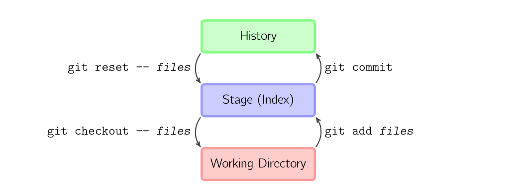

# 基本流程

****

上面的四条命令在工作区域、缓存区域和仓库之间进行流程操作；

+ git add files 把指定文件存入到缓存区域；
+ git commit 将缓存区域产生快照并存储
  + 由于是快照，因此不能对工作区域进行编辑，如果进行更改，只能再进行`commit`
+ git reset --files 用来撤销最后一次git add files，也可以使用git reset 撤销所有缓存区内容；
+ git checkout --files 把工作区域复制到缓存区，用来让其本地修改；

也可以跳过缓存区，直接进文件的读取与提交快照

- `git commit -a `相當於執行 `git add` 把所有目前的目錄下的檔加入暫存區域再執行。`git commit`.
- `git commit *files*` 進行一次包含最後一次提交加上工作目錄中檔快照的提交。並且檔被添加到暫存區域。
- `git checkout HEAD -- *files*` 回滾到複製最後一次提交。

参考文章：

+ [https://marklodato.github.io/visual-git-guide/index-zh-tw.html#basic-usage](https://marklodato.github.io/visual-git-guide/index-zh-tw.html#basic-usage)
+ 