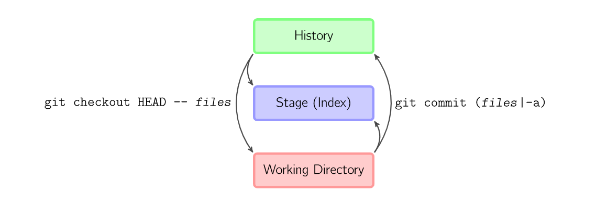
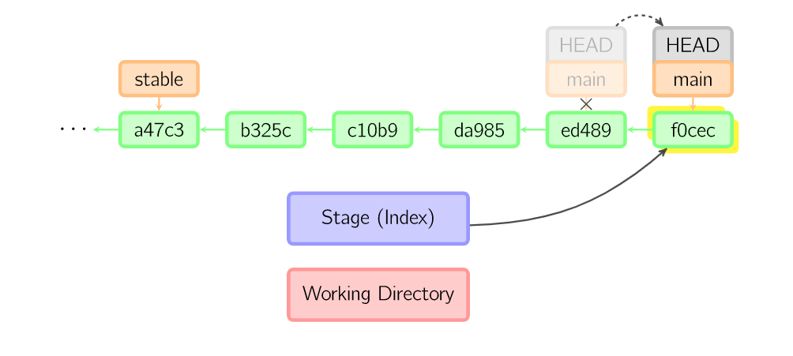
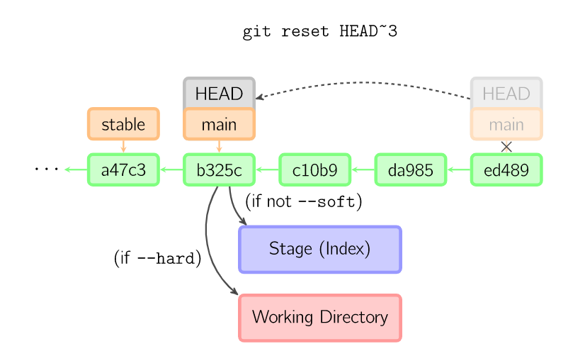

# 基本流程


上面的四条命令在工作区域、缓存区域和仓库之间进行流程操作；

+ git add files 把指定文件存入到缓存区域；
+ git commit 将缓存区域产生快照作为git历史树的一部分。
  + 由于是快照，因此不能对工作区域进行编辑，如果进行更改，只能再进行`commit`
+ git reset --files 用来撤销最后一次git add files，也可以使用git reset 撤销所有缓存区内容；
+ git checkout --files 把工作区域复制到缓存区，用来让其本地修改；

也可以跳过缓存区，直接进文件的读取与提交快照



- `git commit -a `相當於執行 `git add` 把所有目前的目錄下的檔加入暫存區域再執行。`git commit`.
- `git commit *files*` 進行一次包含最後一次提交加上工作目錄中檔快照的提交。並且檔被添加到暫存區域。
- `git checkout HEAD -- *files*` 回滾到複製最後一次提交。

# 基础命令

## Diff

这一条命令，可以查看两次提交之间的变动（可以一次比较多个文件，或者比较单个文件在两个提交之中的区别）


+ 缓存区与工作区域的比较

  ```
  git diff
  ```

+ 缓存区与HEAD的比较

  ```
  git diff --cached
  ```

+ 工作区域与最新的branch的比较/与某个commit比较

  ```
  git diff HEAD
  git diff commit_id
  ```

+ 工作区域与标签的比较

  ```
  git diff tag
  ```

+ 历史树种任意两个节点的比较

  ```
  git commit_id_1 commit_id_2
  ```


## Commit



git用暂存区域的内容建立一个新的commit提交，并把此时的节点设置为父亲节点，然后将HEAD指向新的提交节点。


## Checkout

切换指针，因为是切换指针因此可以实现多个功能：

+ 实现切换分支，因为分支的最新的节点也是commit对象，因此可以直接切换；
+ 实现切换历史版本，每个历史版本都是commit对象，因此可以直接切换到任意一个的历史版本；
+ 实现切换标签号，因为每个标签号本质上也是一个commit对象

**PS：**总结只要是commit对象就能切换。

如果既沒有指定檔案名，也沒有指定分支名，而是一個标签、远端分支、SHA-1值或者是像*main~3*类似的東西，就得到一個匿名分支。也即是称为分离头指针。

因此，想要保存匿名分支的话，那么我们就需要将这个匿名分支新建一个分支`git checkout -b name`


## Reset



TODO

## Merge

合并分支，可以将其他分支合并到当前分支。

# 参考文献

参考文章：

+ [https://marklodato.github.io/visual-git-guide/index-zh-tw.html#basic-usage](https://marklodato.github.io/visual-git-guide/index-zh-tw.html#basic-usage)


