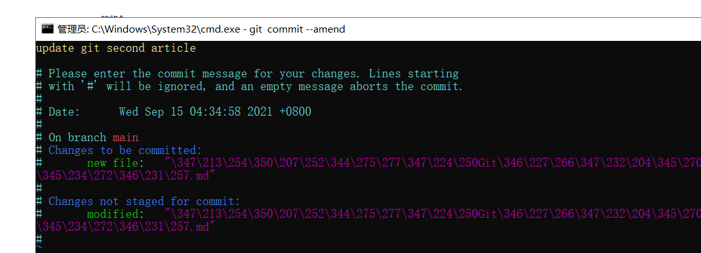
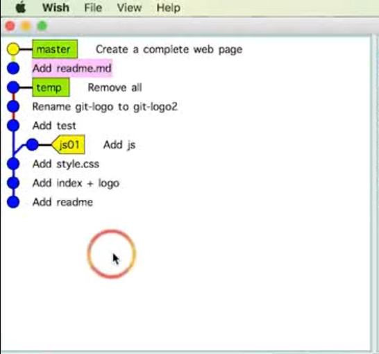
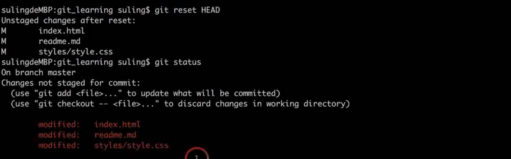

# 删除不需要的分支

删除

```
git branch -d branch_name
```

强制删除，没有merge也可以直接删除

```
git branch -D branch_name
```


# commit 操作

## 修改最新commit的message

```
git commit --amend
```

在这个`vi`界面进行操作；



查看结果

TODO

## 修改老版本的**commit**的**message**

```
git rebase -i commit_id
```

TODO

## 整合多个commit

TODO

```
git rebase -i commit_id
```

这里的`commit_id`选择最基础的的一个。

```
squash   
```


## 整合非连续的commit

会出现多个独立的commit

TODO



# 比较缓存区与HEAD文件的差异

**HEAD**表示的是目前最新一次的**commit**

```
git  diff --cache
```

# 比较工作区和暂存区之间的区别

```
git diff
```


# 让暂存区恢复成和HEAD一样

不保留缓存区的所有文件内容

```
git reset HEAD
```



# 工作区恢复为和暂存区一样

```
git checkout -- <file>
```


ilidilid
