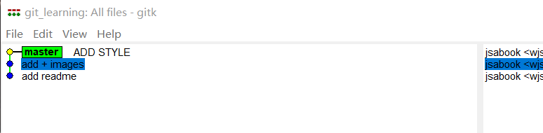
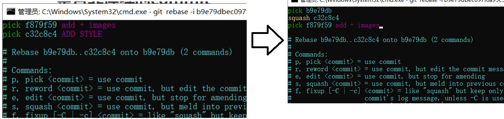

# 删除不需要的分支

删除

```
git branch -d branch_name
```

强制删除，没有merge也可以直接删除

```
git branch -D branch_name
```


# commit 操作

## 修改最新commit的message

```
git commit --amend
```

在这个`vi`界面进行操作；


修订完毕之后，查看这一次提交


可以发现已经发生了修改

TODO

## 修改老版本的**commit**的**message**

```
git rebase -i commit_id_parent_id
```

我们需要选择父亲节点。例如，这里修改`d2d2c1c95019ee6b`


查看，可以得到


进行修改


退出后进行修改


做完操作后，可以发发现产生了新的commit

```
[detached HEAD 56e755a] MOVE README =>Successfully rebased and updated
```

可以发现已经发生了变化


## 整合多个commit

> 因为我们需要在rebase界面修改，因此需要选择父亲的父亲节点。

```
git rebase -i commit_id_parent_parent_id
```

这里的commit也需要选择其commit_parent的父亲节点的id。下面的样例中，把`MOVE README`和`change readme`进行合并。则需要选择`add readme`的ID号（因为这个id号是change readme的父亲commit id）。


选择后，查看


进行修改


修改完毕，则发现已经合并到一起了



c32c8c4

## 整合非连续的commit



显示结果


会出现多个独立的commit

TODO

# 比较暂存区与HEAD文件的差异

**HEAD**表示的是目前最新一次的**commit**

```
git  diff --cache
```

# 比较工作区和暂存区之间的区别

```
git diff
```

# 让暂存区恢复成和HEAD一样

不保留缓存区的所有文件内容

```
git reset HEAD
```

这一条命令也就是清除缓存区（因此reset也有清除的含义）


清除部分文件

```
git reset HEAD -- <file>
```

# 工作区恢复为和暂存区一样

部分文件

```
git checkout -- <file>
```

# 取消最近几次的提交

——将commit从git仓库中消失

```
git reset --hard  old_commit_id
```

将暂存区与工作区都指向`old_commit_id`这个commit。同时`HEAD`也指向`old_commit_id`对应位置。

# 查看不同提交的指定文件的差异

```
git diff dev master -- <file>
```

# 文件/文件夹不纳入管理

创建一个`.gitignore`文件，在文件中放入的文件就不会被管理，支持通配符。

```
doc/
doc
*.doc
doc/*.txt
```

# git 的备份


| 协议名称 | 语法格式                               | 说明             |
| -------- | -------------------------------------- | ---------------- |
| 本地协议 | /path/to/repo.git                      | 哑协议           |
| 本地协议 | file:///path/to/repo.git               | smb协议/智能协议 |
| http协议 | http://git-server.com/path/to/repo.git |                  |
| ssh协议  | user@git-server.com/path/to/repo.git   |                  |

## 哑协议

**下载**

```
git clone --bare file:///path/to/repo.git
```

**上传**

```
git remote add zhineng file:///path/to/repo.git
git push  --set-upstream zhineng branch_name
```

